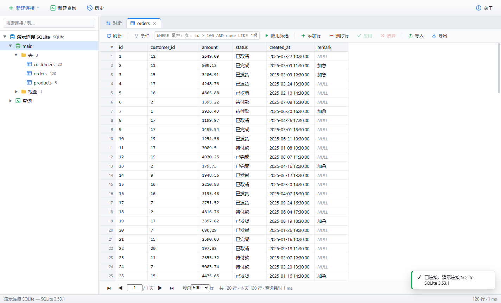
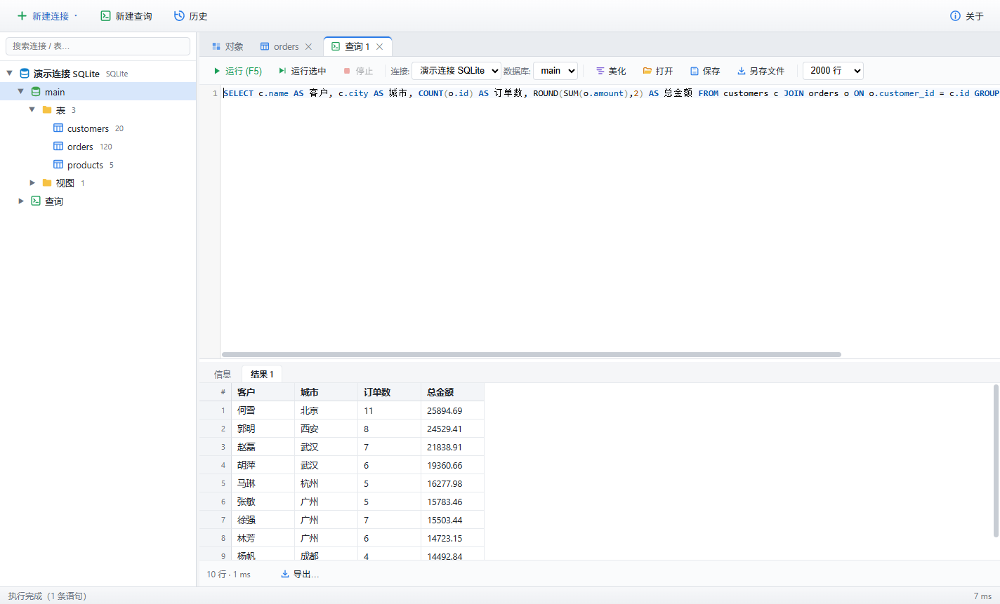
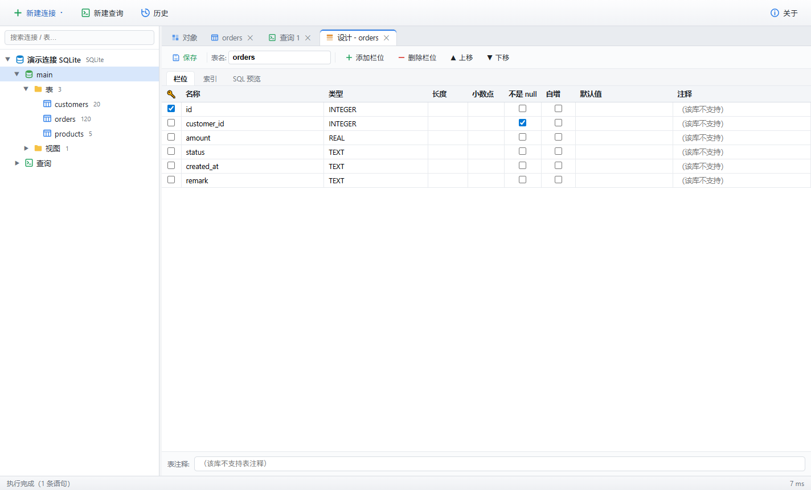
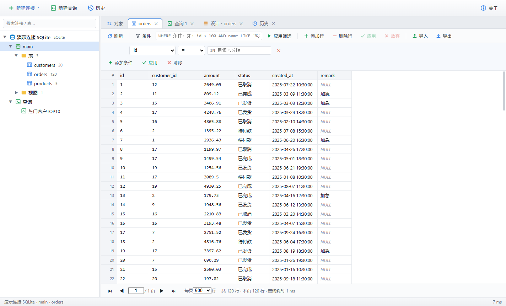

# Datavia — Navicat 风格的数据库管理工具

> **Datavia**（数据之道）· data + via（拉丁语「道路」）

一款可在 Windows 上安装运行的桌面数据库连接管理工具，界面与操作参考 Navicat 设计。
基于 Electron 构建，支持 **MySQL / MariaDB、PostgreSQL、SQLite、SQL Server、ClickHouse、OceanBase（MySQL 模式 / Oracle 模式·实验性）** 等数据库。



| SQL 查询 | 表设计器 | 筛选构建器 |
|---|---|---|
|  |  |  |

## 功能特性

### 连接管理
- 新建 / 编辑 / 删除连接，支持「测试连接」
- **导入 Navicat 连接**：在「文件 → 导入 Navicat 连接…」选择 Navicat 导出的 `.ncx`，预览后可一次导入
  MySQL/MariaDB、PostgreSQL、SQL Server、SQLite、ClickHouse、OceanBase 连接；重复项自动跳过，重名项自动改名。
  数据库密码、SSH 密码及私钥口令会自动兼容 NCX V2 AES 与 V1 Blowfish 格式；明文仅在主进程短时存在，
  导入时立即使用 Electron `safeStorage` / Windows DPAPI 加密保存，不会显示在预览界面。
- **SSH 隧道**：所有网络型数据库均可经跳板机连接（密码 / 私钥文件认证，支持私钥口令），
  数据库主机/端口填写跳板机视角的内网地址；测试连接同样走隧道
- SSH 首次连接会在主进程原生对话框中显示主机密钥 SHA256 指纹，须人工核验后才开始认证；
  已信任指纹保存在 `%APPDATA%/Datavia/ssh-known-hosts.json`，指纹变化时默认拒绝，只有再次明确核验才会更新
- 连接配置保存在本机（`%APPDATA%/Datavia/connections.json`）；数据库密码、SSH 密码、
  私钥口令与 AI API Key 仅在主进程内解密，Renderer 只接收“是否已保存”标记。新凭据必须使用
  Electron safeStorage / Windows DPAPI；系统安全存储不可用时会拒绝落盘，而不会退化为明文/Base64。
  已保存凭据同时绑定主机、端口、大小写敏感用户名、SSH 路由及 TLS/HTTPS 策略，目标变化时必须重输
- SQL Server 支持加密连接与信任服务器证书选项；SQLite 文件必须经固定用途的系统对话框选择或新建，
  查询 SQL 禁止用 `ATTACH` / `VACUUM INTO` 绕过该本地文件边界
- ClickHouse 走 HTTP 接口（默认 8123），支持 HTTPS（云服务 8443）
- OceanBase 走 MySQL 兼容协议（直连 2881 / OBProxy 2883），用户名格式 `用户@租户#集群`；
  Oracle 模式租户按 Schema 浏览（`all_*` 视图取元数据、ROWNUM 分页、CURRENT_SCHEMA 切换）

### 数据库浏览（左侧连接树）
- 连接 → 数据库 →（PostgreSQL：模式）→ 表 / 视图 / **函数（存储过程）/ 触发器 / 事件（MySQL）/
  序列（PG、SQL Server、OB-Oracle）** 层级树，懒加载；连接级还有「查询」（保存的查询）与
  「**用户**」节点（MySQL/PG/MSSQL/ClickHouse，查看权限或属性、删除用户）
- 函数/触发器等对象支持：双击**查看定义**（DDL，一键复制）、删除、按方言生成**新建模板**
- 表行数预估、顶部搜索框快速过滤
- 右键菜单：打开表、设计表、导入导出、重命名、清空表、删除表/视图、新建/删除数据库等
- 查询编辑器对 MySQL 存储过程/触发器**整段执行**（无需 DELIMITER），脚本中混写触发器
  也能正确按过程体拆分（SQLite/MySQL）

### 对象列表（「对象」标签页）
- 当前库的表 / 视图清单：名称、类型、行数、注释/引擎
- 工具栏：打开表、设计表、新建查询、导出 CSV、删除、刷新、筛选

### 表数据浏览与编辑
- 分页浏览（100/500/1000 行每页）、总行数统计
- 点击列头排序（升/降/取消）、WHERE 条件筛选
- **筛选构建器**：点选式拼条件（字段 + 操作符 + 值，AND/OR 连接，含 LIKE/IN/IS NULL 等），
  生成的 WHERE 回填到输入框可继续手工编辑
- **行内编辑**：双击单元格修改、添加行、删除行；「应用」在事务中提交（出错自动回滚），「放弃」撤销全部更改
- 右键单元格：查看单元格（长文本查看器）、复制、设为 NULL
- 无主键的表自动只读保护；修改的单元格、新增行、待删除行有颜色标识
- 列宽拖拽调整；导出当前表（含筛选条件）为 CSV（UTF-8 BOM，Excel 可直接打开）

### SQL 查询编辑器
- CodeMirror 语法高亮（按方言）、行号、括号匹配
- **智能自动补全**：**输入 `.` 即自动弹出** —— `表名.`/`别名.` 列出字段、`库名.` 列出表；
  裸词联想表名与 SQL 关键字；别名自动解析（`FROM customers c … c.` 识别 `c`→customers）。
  整库表→列映射按库懒加载缓存，Ctrl+Space 亦可手动触发
- F5 / Ctrl+Enter 运行；支持「运行选中」；多语句脚本逐条执行并分别显示结果
- **停止查询**：按查询请求精确取消，不影响同一连接的其他标签页或后台任务；MySQL 系使用
  定向会话销毁、PostgreSQL 销毁对应 PoolClient、SQL Server 取消 Request、ClickHouse 中止 HTTP
  并按 `query_id` 尝试服务端 KILL（SQLite 为同步引擎，不支持取消）
- **SQL 美化**（Ctrl+Shift+F）：按连接方言格式化（sql-formatter），可只格式化选中部分
- **保存查询到连接**（Ctrl+S）：保存的查询挂在连接树「查询」节点下，双击打开、重命名、删除；
  也可「另存文件」/「打开」普通 .sql 文件
- 多结果集标签页 + 「信息」面板（每条语句的影响行数 / 耗时 / 错误）
- 结果行数上限可选（200 / 2000 / 10000）；可安全改写的常见 SELECT/CTE 会按方言在数据库侧下推
  `maxRows + 1` 探针，避免驱动先完整加载大结果集，并明确标记总行数是否精确；无法保证等价改写的
  特殊语法会保守退回驱动返回后的显示截断

### 查询历史
- 自动记录每次查询（时间 / 连接 / 库 / SQL / 耗时 / 成败与错误信息），本地保留最近 500 条
- 工具栏「历史」打开历史页：搜索过滤、查看完整 SQL、复制、双击在新查询标签中重新打开

### 可视化表设计器（新建 / 修改表）
- 栏位编辑：名称、类型（按方言提示）、长度/小数点、NOT NULL、主键、自增、默认值、注释，支持增删行/上下移动
- 索引编辑：增删索引、唯一索引
- **SQL 预览**：实时显示将要执行的 CREATE / ALTER 语句，保存前需确认
- 修改表按差异生成各方言 ALTER（重命名、改类型、默认值、主键、索引、表注释等）；
  各数据库不支持的操作会给出明确告警而不是盲目执行（如 SQLite 改类型需重建表）
- 视图仍为只读“查看定义”（含 DDL 一键复制）

### 数据导入向导
- 支持 CSV / TSV / TXT（可选分隔符、UTF-8/GBK 编码、首行字段名）、JSON（对象数组）、Excel(xlsx)（可选工作表）
- 导入到现有表（自动按列名匹配字段映射，可手动调整/忽略）或一键创建新表
- 选项：空字符串视为 NULL、导入前清空表、出错终止/跳过错误行（跳过模式逐行挽救）
- 批量事务提交 + 实时进度条，结束后报告成功/失败行数与错误样例

### 数据导出（表 / 查询结果通用）
- **CSV**（UTF-8 BOM）、**Excel xlsx**（流式写出，支持大表）、**JSON**、**SQL INSERT**（按连接方言转义）、**Markdown 表格**
- 整表导出直接读取驱动原始值，不经过界面预览截断；CSV / JSON / SQL 中长文本与 BLOB 保真，
  XLSX 会自动拆分工作表，但受 Excel 单元格 32,767 字符上限约束，超长值会明确提示改用无损格式
- CSV 会给以 `= + - @` 等开头的**文本**增加防公式注入前缀，数值负数保持数值；SQL Server 的
  精确小数、高精度时间和别名类型在驱动解析前由服务端转换为文本；MySQL/PG/ClickHouse 的 JSON、
  64 位整数、小数和数组也禁用有损解析。NaN/Infinity 在 JSON 中保留为文本，SQL 格式会明确拒绝
- 大表有真实主键时按复合主键做游标分页，避免 OFFSET 导致的重复/遗漏；没有稳定唯一主键且超过
  5,000 行时会拒绝不可靠的多页导出。游标分页不是跨页一致性快照，持续写入期间应在低峰执行并复核

### DBA 工具
- **数据传输**：跨连接/跨库复制表结构+数据，**支持跨数据库类型**（内置类型映射，如
  MySQL `datetime`→PG `timestamp`、`longtext`→`nvarchar(max)`），多表选择、批量事务、进度显示、
  出错继续选项；BLOB 按方言十六进制字面量保真复制；MySQL 行数据字面量不受
  `NO_BACKSLASH_ESCAPES` 影响，SQL Server 精确数值/时间在转储、传输和同步读取时同样保真
- **转储 SQL 文件**：库/模式右键一键导出全部表的 DROP+CREATE+INSERT 脚本
- **运行 SQL 文件**：大 .sql 文件流式执行（不进编辑器），UTF-8/GBK、进度与失败统计、出错继续
- **进程列表**：连接右键打开会话监控（MySQL/OB、PG、MSSQL、ClickHouse），自动刷新、过滤、
  结束选中会话（KILL / pg_terminate_backend / KILL QUERY）
- **结构同步**：比对两库表结构（可跨连接/跨方言），目标缺表生成 CREATE、已有表生成差异
  ALTER（加列/改类型/索引/注释等），**先审查完整脚本**再选择执行到目标或保存；删除目标
  多余栏位/表为显式选项（默认保留）
- **数据同步**：按主键逐行比对生成 INSERT / UPDATE（仅差异列）/ DELETE（可选）；
  数字主键走**流式归并**（百万行级内存恒定），字符串主键走内存映射（≤50 万行）；
  三种方式：仅统计差异、生成脚本文件、直接应用（批量事务）；数值/日期格式差异自动归一
  （`3.50` 与 `3.5` 视为相同），避免误报

### ER 关系图与执行计划
- **ER 关系图**：数据库/模式右键「ER 关系图」，SVG 绘制表盒（列含主键 🔑 / 外键 ◆ 标记 + 类型）
  与外键连线（箭头指向被引用表）；支持拖拽表盒、平移、滚轮缩放、适应窗口、重新布局、**导出 PNG**
- **执行计划（EXPLAIN）**：查询编辑器「解释」按钮可视化执行计划——PostgreSQL/SQLite 渲染为
  **计划树**（节点含行数/代价热度条，全表扫描标 ⚠）；MySQL/OceanBase/SQL Server 渲染为计划表
  （`type`/`PhysicalOp` 列着色提示优劣）；ClickHouse/OB-Oracle 显示文本计划

### 浏览增强（外键 / 查找 / 表单 / BLOB）
- **外键**：设计表/查看定义中展示外键（本表栏位 → 引用表.栏位）；数据网格右键外键单元格
  可「**跳转到关联表**」，按引用列值打开目标表（MySQL/PG/SQL Server/SQLite/OB-Oracle）
- **在库中查找**（Ctrl+F / 工具菜单）：按对象名（表/视图/列）或数据内容（遍历各表文本列 LIKE）
  查找，结果双击直达所在表（数据匹配按主键精确定位）
- **表单视图**：表数据页「表单视图」一键切换，单条记录纵向显示/编辑（宽表友好），上一条/下一条导航，
  编辑与网格共享提交状态
- **BLOB 查看器**：单元格查看器自动识别图片（PNG/JPEG/GIF/BMP/WebP）并预览，其余二进制以
  十六进制 + ASCII 转储显示，可复制

### AI 助手与生产库保护
- AI 助手兼容 DeepSeek、OpenAI、通义、智谱、Ollama 等 `/chat/completions` 接口，可解释、优化、排查和生成 SQL；
  发送前界面会明确说明 SQL/问题及按需读取的表名、列名将提交到用户配置的接口
- 标记为「生产」的连接由**主进程**强制执行审批策略：查询页的全部自由 SQL（包括 SELECT）、表数据编辑、对象操作、设计器、导入、
  数据传输、整表/转储导出、会话终止、结构同步执行、数据同步生成脚本或直接应用、SQL 文件执行等
  生产操作需输入连接名，并通过主进程原生确认；审批令牌 30 秒有效、单次使用，并绑定窗口、操作、
  完整参数及弹窗前的连接配置快照
- Renderer 文件读写采用路径能力白名单：只有经系统打开/保存对话框由用户选择过的路径才可通过 IPC 访问；
  SQLite 数据库和 SSH 私钥另用不可互相升级的专用授权，应用自身凭据/信任配置文件禁止从 Renderer 访问。
  生产 SQL 文件/导入审批绑定 SHA-256 内容，执行前复制到 Renderer 无法改写的私有快照

### 体验
- **Navicat 风格界面**：原生菜单栏（文件/编辑/查看/工具/窗口/帮助，常用功能全部接通）+
  大图标工具栏（图标在上文字在下）；工具栏「表/视图/函数/触发器/事件/序列/用户/查询」
  按钮即点即切对象页内容（当前类型高亮），对象页工具栏随类型自适应
- **深色模式**：工具栏「主题」一键切换，全界面（含 SQL 编辑器）适配，偏好本地记忆
- **连接分组与颜色标记**：连接可设分组（树上成文件夹）与颜色（生产标红）；
  颜色体现在树的连接标记条与每个相关标签页的圆点上，配合主进程审批防止误操作生产库
- **网格多格式复制**：右键行 → 复制为 Tab 分隔 / 带表头（直接贴 Excel）/ INSERT 语句
  （按连接方言转义）/ CSV / Markdown，支持多选行

### 其它
- 多标签页工作区（Ctrl+W 关闭），未保存更改关闭时提示
- 状态栏显示当前上下文、行数与耗时；操作结果 Toast 提示
- F12 打开开发者工具

## 开发运行

```bash
npm ci           # 按 package-lock 精确安装依赖（.npmrc 仅配置 Electron 等二进制下载镜像）
npm start        # 启动应用
```

其它脚本：

```bash
npm run selftest # 数据库层自检（无需外部数据库，使用 SQLite 跑通全链路）
npm run smoke    # 界面冒烟测试（隐藏窗口，校验 DOM 与控制台无报错）
npm run verify   # 依次运行 selftest + smoke
npm run integration # 真实数据库适配器测试（元数据/服务端限行；可选 CRUD、原始导出与逐请求取消）
npm run demo     # 演示模式：自动建示例库、打开界面操作并截图到 shots/
npm run dist     # 打包 Windows 安装程序（输出到 release/）
```

GitHub Actions 会在 Windows 跑自检、界面冒烟与目录打包，并以 MySQL 8.4、PostgreSQL 16、
SQL Server 2022、ClickHouse 24.8 服务矩阵验证元数据、CRUD、高精度原始导出和逐请求取消。

## 打包安装程序

```bash
npm run dist
```

输出 `release/Datavia-Setup-<版本>.exe`（NSIS 安装包，支持选择安装目录、创建桌面/开始菜单快捷方式）。
正式发布可通过 electron-builder 标准的 `CSC_LINK` / `CSC_KEY_PASSWORD` 环境变量注入代码签名证书；
仓库不保存任何签名私钥。

## 技术架构

```
src/
├── main/                 # Electron 主进程
│   ├── main.js           # 入口：窗口、单实例、退出确认、测试模式
│   ├── ipc.js            # IPC 处理器（统一 {ok,data|error} envelope）
│   ├── store.js          # 连接配置持久化（safeStorage 加密密码）
│   ├── safety.js         # 生产库审批策略、短时单次令牌与参数指纹
│   ├── fileAccess.js     # 系统文件对话框授予的路径能力白名单
│   ├── preload.js        # contextBridge 暴露 window.api
│   └── db/               # 数据库适配层
│       ├── base.js       # 适配器基类：分页/脚本执行/编辑 SQL 生成/事务
│       ├── mysql.js      # mysql2（连接池，USE 切库）
│       ├── postgres.js   # pg（按库建池，模式支持）
│       ├── mssql.js      # mssql/tedious（批执行，OFFSET 分页，GO 分批）
│       ├── clickhouse.js # @clickhouse/client（HTTP，JSONCompact，网格只读）
│       ├── oceanbase.js  # 继承 MySQL 适配器（MySQL 兼容模式，ob_version 识别）
│       ├── oboracle.js   # OB Oracle 模式（mysql2 线协议 + Oracle 方言/目录，实验性）
│       ├── sqlite.js     # better-sqlite3，失败自动回退 sql.js (WASM)
│       └── sqlutil.js    # SQL 拆分（引号/注释/美元引用感知）、值清洗、CSV
└── renderer/             # 渲染进程（原生 ES Modules，无打包器）
    ├── index.html / css/app.css
    └── js/               # tree 连接树 / tabs 标签页 / grid 可编辑网格
                          # queryTab SQL 编辑器 / tableTab 数据页 / structTab 结构
                          # connDialog 连接对话框 / contextmenu / toast / …
```

- 渲染进程开启 `contextIsolation`，所有数据库操作经 IPC 在主进程执行
- 生产环境策略、凭据解密与文件路径授权均在主进程校验，Renderer 不持有已保存密钥
- 编辑提交按主键生成 `UPDATE/INSERT/DELETE`，在**事务**中执行，任一失败整体回滚
- 单元格值经清洗后传输：日期格式化、BigInt/Buffer 安全转换、超长文本截断

## 常见问题

- **Electron 下载失败 / 404**：国内网络需配置镜像。本项目 `.npmrc` 已内置
  `electron_mirror=https://npmmirror.com/mirrors/electron/`。注意旧的
  `npm.taobao.org` 域名已停服，如你的全局 `~/.npmrc` 里还有旧地址请更新为 `npmmirror.com`。
- **better-sqlite3 加载失败**：应用会自动回退到 sql.js（WASM）继续支持 SQLite，
  连接信息中会显示 `(WASM)` 标记。
- **SQL Server 连接失败（证书）**：默认勾选「信任服务器证书」；连接 Azure 时勾选「加密连接」。
- **SQL Server 的 GO**：查询编辑器支持以独立行 `GO` 分批执行。
- **ClickHouse 表为什么只读**：ClickHouse 的“主键”是排序键、不保证唯一，按键 UPDATE/DELETE
  不安全，且 MergeTree 修改数据需走 mutation。请直接用 SQL：`INSERT INTO …`、
  `ALTER TABLE … UPDATE/DELETE WHERE …`。查询、建删库表、清空、重命名、导出 CSV 均正常支持。
- **验证 ClickHouse 连通性**：`node scripts/test-clickhouse.js`（用 `CH_HOST`/`CH_PORT`/
  `CH_USER`/`CH_PASSWORD`/`CH_HTTPS=1` 指向你的服务），可对适配器做端到端检查。
- **OceanBase 连不上 / 拒绝访问**：确认用户名带租户（直连为 `用户@租户`，如 `root@sys`；
  经 OBProxy 为 `用户@租户#集群名`），端口直连 2881、OBProxy 2883。
- **OceanBase Oracle 模式（实验性）**：OB 所有租户走同一套 MySQL 兼容线协议，本工具据此用
  mysql2 连接 Oracle 租户并按 Oracle 方言操作（Schema 浏览、ROWNUM 分页、`all_*` 目录、
  `DBMS_METADATA` 取 DDL、网格按主键编辑）。官方不承诺原生 MySQL 客户端的完全兼容，
  个别数据类型（如 INTERVAL、TIMESTAMP WITH TIME ZONE）或 PL/SQL 多语句块可能异常；
  查询编辑器会将单个 PL/SQL 块（BEGIN…END）作为整体执行，多个独立块建议分别运行。
  没有 Schema 层级管理（建/删用户请用 `CREATE USER` / `DROP USER`）。

## 已知限制（后续规划）

- OceanBase Oracle 模式仍属实验性，复杂 PL/SQL 块和少数 Oracle 专有类型可能需要直接使用专有客户端
- SQLite 查询由同步引擎执行，无法中途取消；特殊 SELECT、DML RETURNING/OUTPUT、多语句批次等无法
  安全下推外层行数探针时，会退回驱动完整返回后的界面截断，此类查询仍应自行添加合适的 LIMIT/TOP
- 数据同步要求两端主键一致；字符串主键采用内存映射，单表上限 50 万行
- 跨库传输/同步采用分页读取和分批事务，不提供跨异构数据库的一致性快照；源库持续写入时应在业务低峰执行并复核结果
- 表设计器会跳过目标方言不支持的变更并显示警告，例如 SQLite 修改列类型需要重建表
- 当前仓库未内置自动更新服务；公开分发的 Windows 安装包应在发布环境配置代码签名
